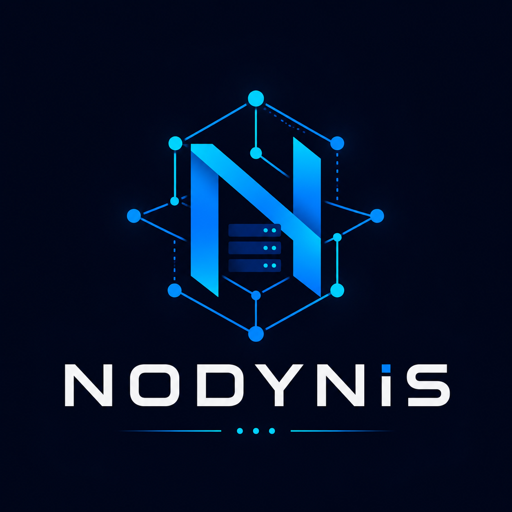

    
    
<b>Node Dynamic Infrastructure System</b>

    
<i>"센서, 서버, 애플리케이션을 하나의 동적 노드 인프라로 연결하는 1인 시스템 브랜드"</i>

<h3>🏗️ System Architecture</h3>

이미지 추가 예정

<h3>🛠️ Tech Stack</h3>

<h4>🎨 FRONTEND</h4>

    
    
    
    

<h4>⚙️ BACKEND</h4>

    
    
    
    

<h4>🤖 AGENT</h4>

    

<h3>📂 Organization Repositories</h3>

| Repository          | Role                           | Tech Stack            | Status     |
| :------------------ | :----------------------------- | :-------------------- | :--------- |
| [**BE_NODYNIS**]()  | Central API & Logic Server     | Spring Boot, MyBatis  | 📅 Planned |
| [**FE_NODYNIS**]()  | Real-time Monitoring Dashboard | Next.js, Tailwind CSS | 📅 Planned |
| [**AGT_NODYNIS**]() | Hardware Resource Collector    | Python                | 📅 Planned |

<h3>🚀 Vision</h3>

NODYNIS는 파편화된 하드웨어 리소스와 센서 데이터를 단일화된 노드 인프라로 통합하여, 관리자가 시스템의 상태를 직관적으로 파악하고 동적으로 제어할 수 있는 환경을 구축하는 것을 목표로 합니다.

  

  Built by <b>NODYNIS</b>. © 2026 All rights reserved.

